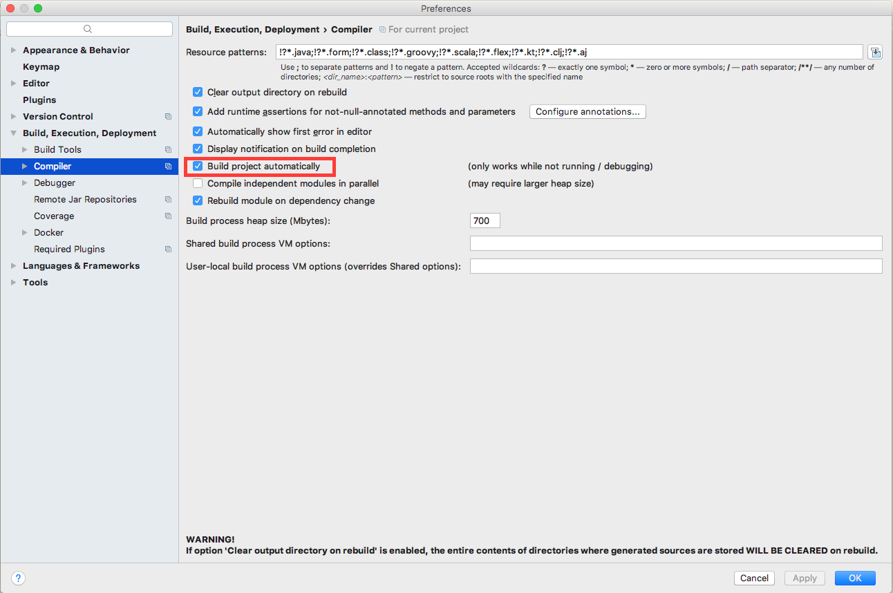

# Spring Loaded Example

This is an example application using Spring-Boot, Kotlin, Gradle, IntelliJ Idea, 
and [Spring-Loaded](https://github.com/spring-projects/spring-loaded).

## Usage

1. Boot the app using `bootRun`
1. Make a change to the code
1. Refresh the browser to see the change made

If you have configured Idea to `Build project automatically`, it should automatically recompile the code when you
make a change. I've noticed this doesn't always work, in which case you can use `CMD+F9` to rebuild the project in
Idea.

Alternatively, you can use the continuous build feature of gradle in another terminal window, which will watch
for changes and recompile the code as needed.
```bash
./gradlew -t compileKotlin
```

***Note***: It seems the `spring-loaded` will handle changes to classes that already exist, but if you create a
new class, you'll have to reboot the server.

## Configuring Idea

Make sure to check `Build project automatically` under `Build, Execution, Deployment -> Compiler` settings.

